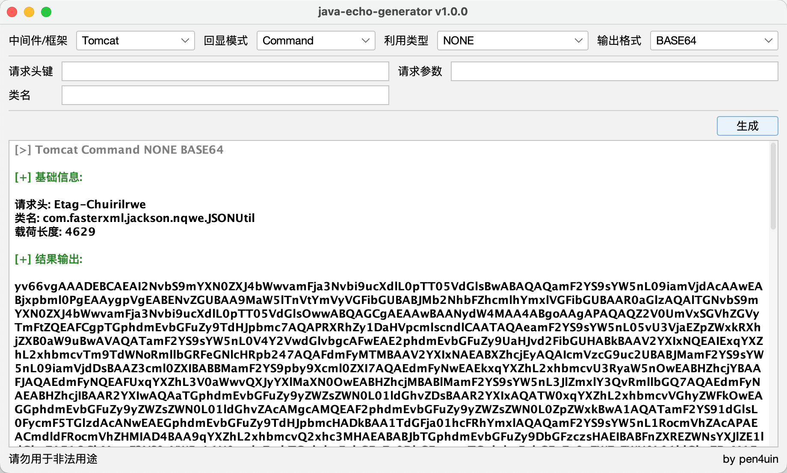
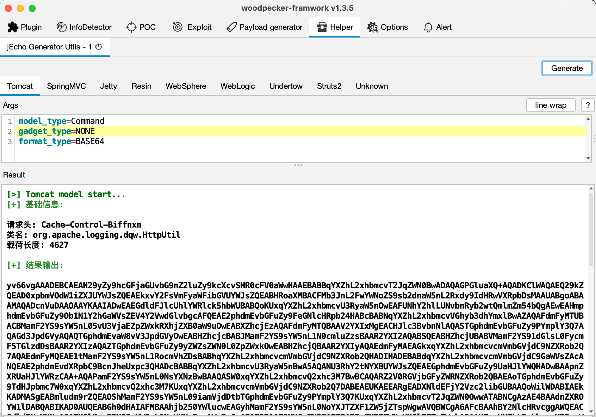

# Java Echo Generator


## 0x01 Introduce

**jEG (Java Echo Generator )** 是一款支持高度自定义的 Java 回显载荷生成工具。

主要功能如下：

* 支持的中间件和框架（Tomcat/Resin/Jetty/WebLogic/WebSphere/Undertow/SpringMVC/Struts2）
* 支持的执行模式（Command/Code）
* 支持的输出格式 (BASE64/BCEL/BIGINTEGER/CLASS/JAR/JS)


> 此工具仅限于安全研究和教学，用户承担因使用此工具而导致的所有法律和相关责任！ 作者不承担任何法律和相关责任！


## 0x02 Usage

**图形化**

1. 下载 jEG-GUI-1.0.0.jar 运行即可



**Woodpecker 插件**

1. 下载 jEG-Woodpecker-1.0.0.jar 到 woodpecker 插件目录下即可



**第三方库**

1. 下载 jEG-Core-1.0.0.jar 并安装到本地 maven 仓库

```shell
mvn install:install-file -Dfile=jEG-Core-1.0.0.jar -DgroupId=jeg -DartifactId=jeg-core -Dversion=1.0.0 -Dpackaging=jar
```

2. 引入自己的框架/工具的依赖中

```xml
<dependency>
    <groupId>jeg</groupId>
    <artifactId>jeg-core</artifactId>
    <version>1.0.0</version>
</dependency>
```

3. 调用 API 生成需要的回显载荷即可

```java
// 基本配置
jEGConfig config = new jEGConfig() {{
    // 设置待回显的中间件为 tomcat
    setServerType(Constants.SERVER_TOMCAT);
    // 设置待执行的 payload 为命令执行回显
    setModelType(Constants.MODEL_CMD);
    // 设置 payload 的输出格式为 BASE64
    setFormatType(Constants.FORMAT_BASE64);
    // 初始化基础配置
    build();
}};
// 生成 payload
jEGenerator generator = new jEGenerator(config);
System.out.println("请求头: " + config.getReqHeaderName());
System.out.println(generator.getPayload());
```

## 0x03 Reference

使用手册

- [jEG - 高度自定义的 Java 回显生成工具](https://mp.weixin.qq.com/s/_TmPJnKtstL3KeysoyLcVA)


```
- https://gv7.me/articles/2020/semi-automatic-mining-request-implements-multiple-middleware-echo/
- https://gist.github.com/fnmsd/8165cedd9fe735d7ef438b2e977af327
- https://github.com/feihong-cs/Java-Rce-Echo
```


